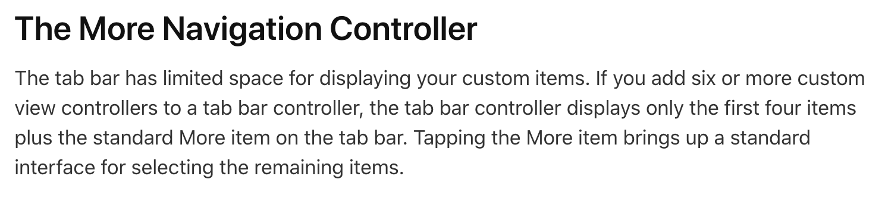
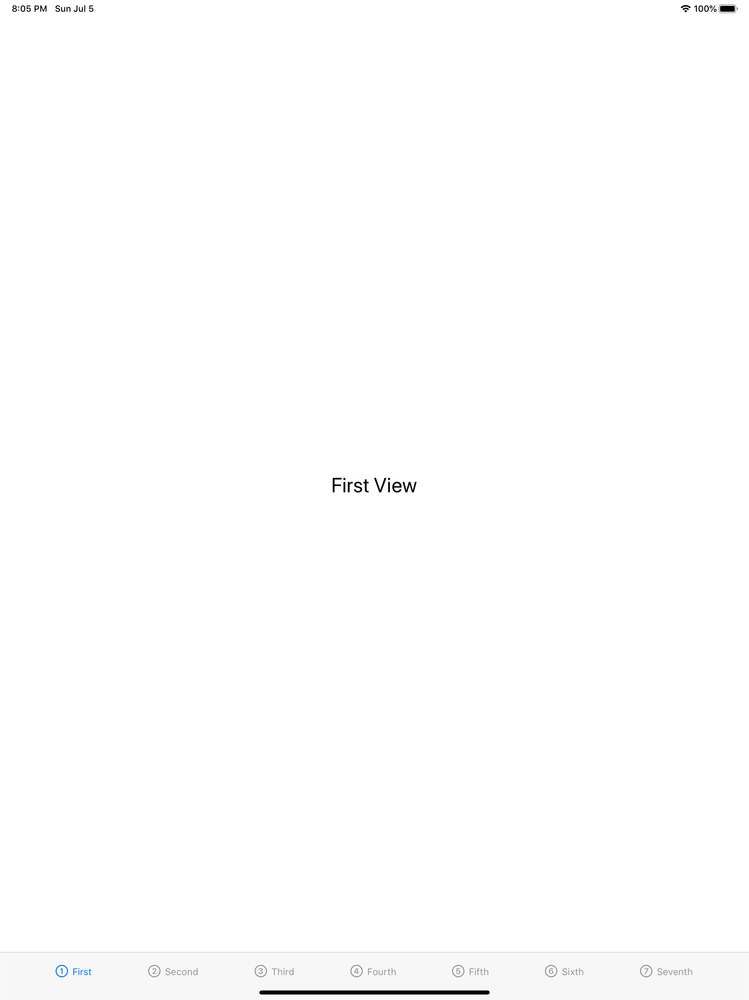

# FB7659700

This effects anything when traitCollection.horizontalSizeClass != .compact

It seems like this is not true for iPads anymore (or anything that isn't .compact) and the value is actually 8 tabs.

This can lead to App rejection for having the tab bar be over crowded.